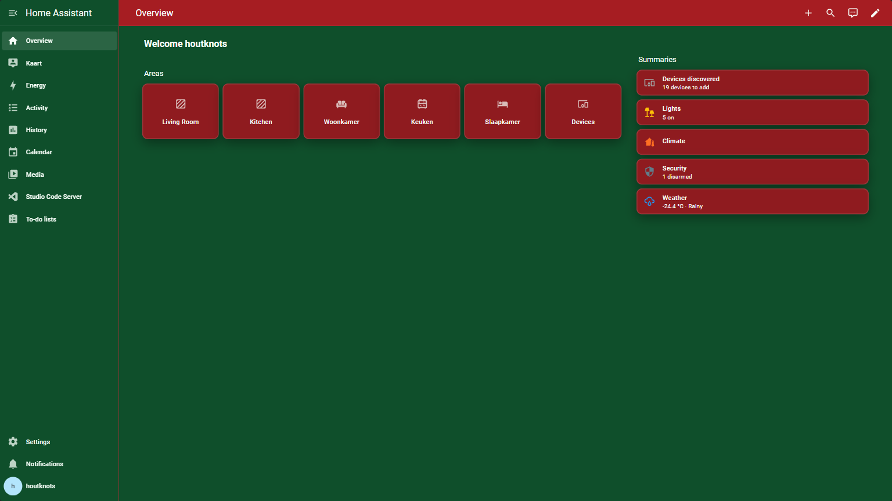
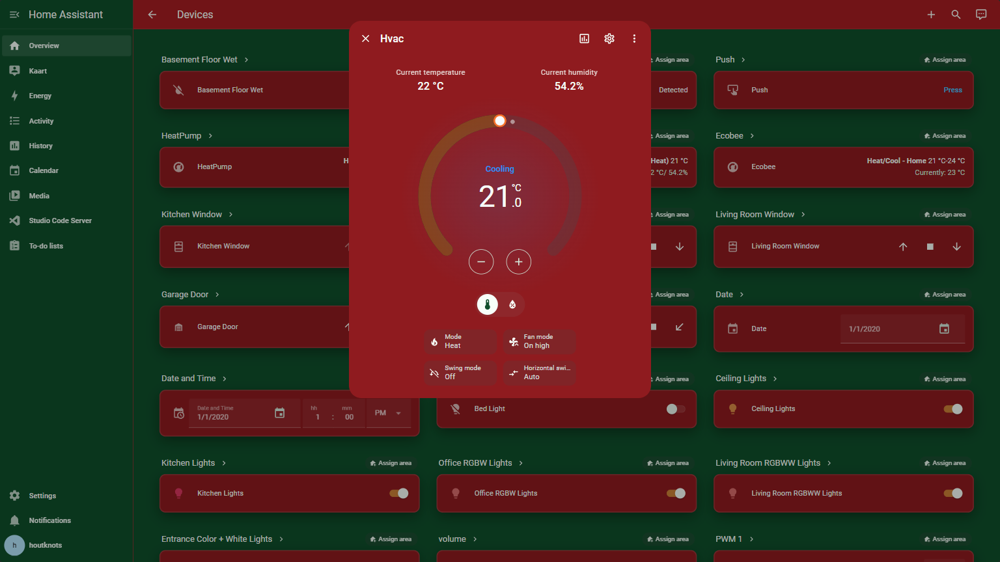
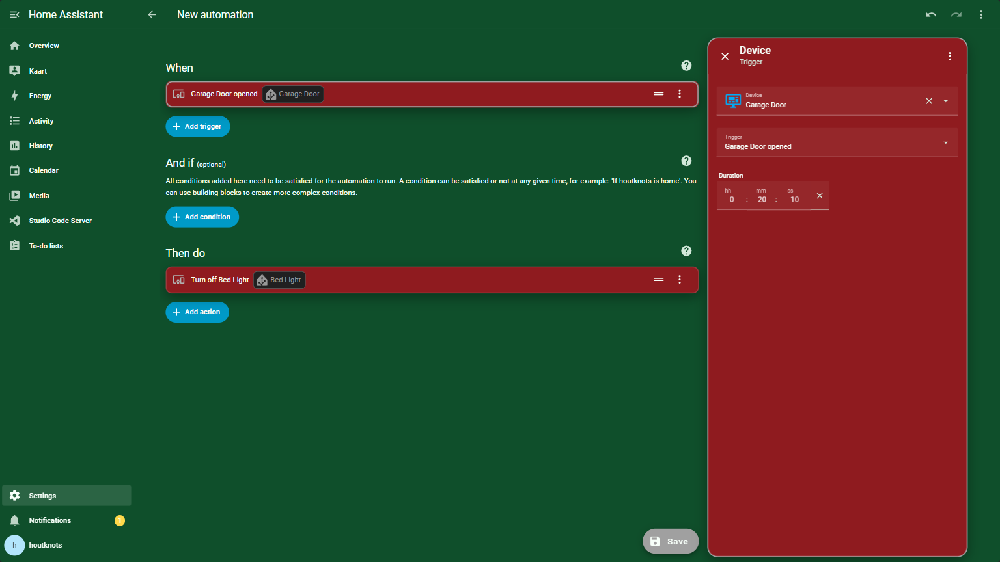
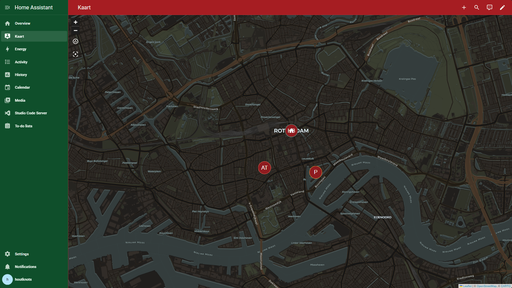
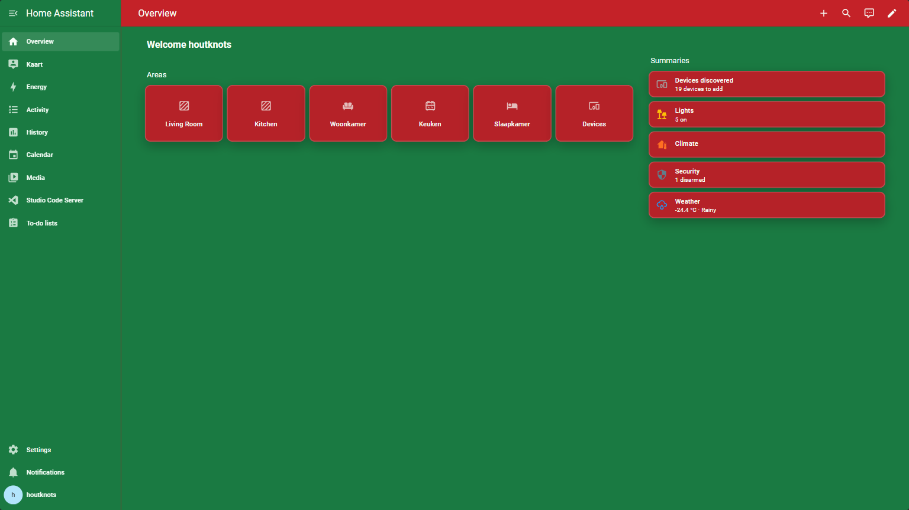
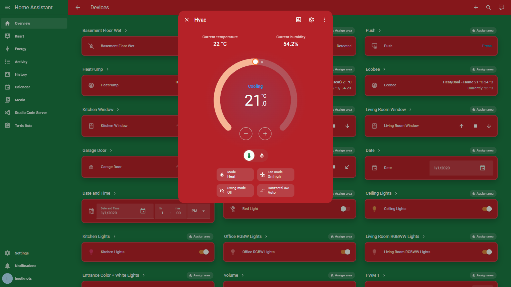
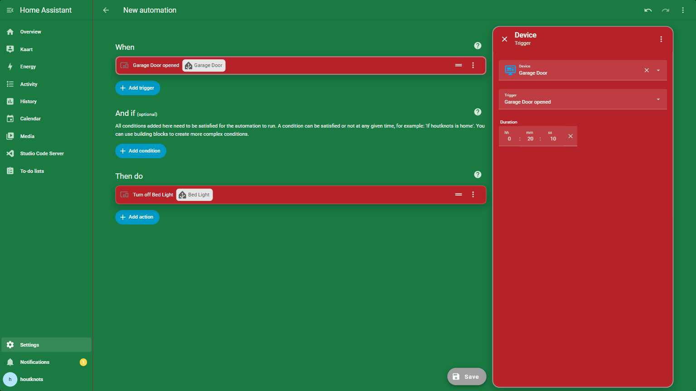
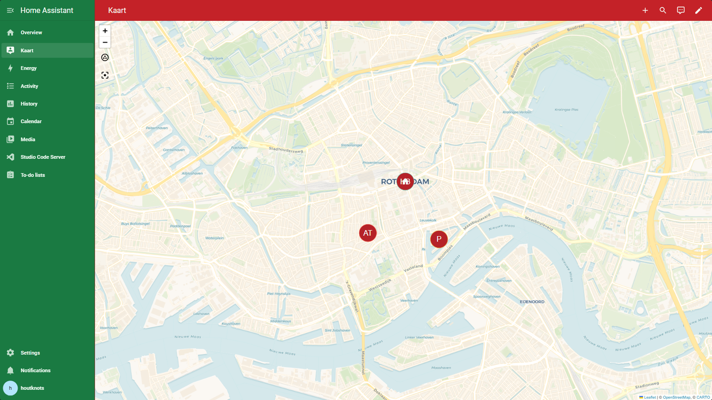

# Ugly Christmas Theme
Ugly Christmas Theme that over time has evolved into a more beautifulish christmassy theme.

## Installation

### Preparation
1. Make sure that under the **configuration.yaml** file you have the following:

```yaml
frontend:
  themes: !include_dir_merge_named themes/
```

2. Under the Home Assistant **Config** folder, create a new folder named **themes**
3. **Restart** Home assistant to apply the changes.

### HACS installation
1. Within the Community Store (HACS) search for "Ugly Christmas Theme"
2. Open the Theme
3. Press the "Install" button
4. Restart Home-Assistant or reload your themes
5. Apply the theme from within your profile settings or set it as backend-selected theme.

## Screenshots
### Dark Mode
#### Overview

#### More info popup

#### Automation Editor

#### Map

### Light Mode
#### Overview

#### More info popup

#### Automation Editor

#### Map

